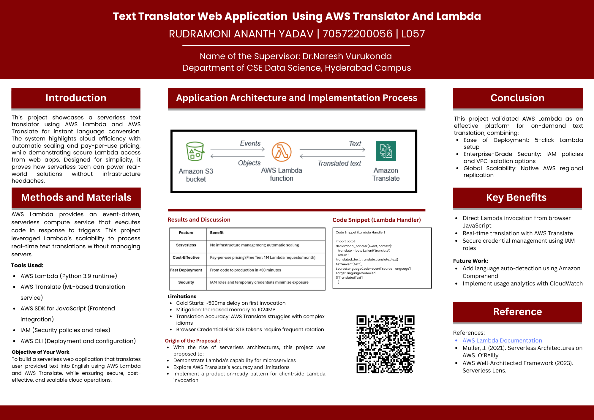

# AWS Text Translator Pro

A modern, serverless web application built with React and TypeScript that provides real-time text translation using Amazon Translate service.



## 🚀 Quick Start

```bash
# Install dependencies
npm install

# Start development server
npm run dev

# Build for production
npm run build
```

## 📁 Project Structure

```
aws-text-translator-pro/
├── src/                    # Source code
│   ├── components/         # React components
│   ├── utils/             # Utility functions
│   ├── App.tsx            # Main app component
│   ├── config.ts          # Configuration
│   └── types.ts           # TypeScript types
├── lambda/                # AWS Lambda backend
│   ├── lambda_function.py
│   └── s3-bucket-policy.json
├── docs/                  # Documentation
├── public/                # Public assets
└── scripts/               # Build scripts
```

## ✨ Features

- 🌍 16+ languages supported
- 🤖 Auto language detection
- ⚡ Real-time translation
- 📋 Copy to clipboard
- 🔄 Language swap
- 📱 Mobile responsive
- 🎨 Modern UI with Tailwind CSS
- 🔒 Secure AWS integration

## 📚 Documentation

- **[docs/QUICKSTART.md](docs/QUICKSTART.md)** - 5-minute setup
- **[docs/SETUP.md](docs/SETUP.md)** - Detailed setup guide
- **[docs/deployment-guide.md](docs/deployment-guide.md)** - AWS deployment
- **[docs/ARCHITECTURE.md](docs/ARCHITECTURE.md)** - System architecture
- **[docs/](docs/)** - All documentation

## 🛠️ Technology Stack

- **Frontend**: React 18 + TypeScript + Vite
- **Styling**: Tailwind CSS
- **Backend**: AWS Lambda (Python 3.12)
- **Translation**: Amazon Translate
- **Hosting**: Amazon S3
- **Icons**: Lucide React

## 📦 Installation

### Prerequisites
- Node.js 18+
- AWS Account
- npm or yarn

### Setup

1. **Clone the repository**
```bash
git clone <repository-url>
cd aws-text-translator-pro
```

2. **Install dependencies**
```bash
npm install
```

3. **Configure Lambda URL**
   - Update `src/config.ts` with your Lambda Function URL

4. **Start development**
```bash
npm run dev
```

## 🚢 Deployment

### Backend (AWS Lambda)
1. Create Lambda function with Python 3.12
2. Copy code from `lambda/lambda_function.py`
3. Add `TranslateFullAccess` IAM policy
4. Create Function URL with CORS enabled

### Frontend (S3)
1. Build the application: `npm run build`
2. Create S3 bucket with static hosting
3. Upload `dist/` contents
4. Apply bucket policy from `lambda/s3-bucket-policy.json`

See [docs/deployment-guide.md](docs/deployment-guide.md) for detailed instructions.

## 💰 Cost

Approximately **$1-2/month** for low traffic:
- S3: ~$0.00
- Lambda: Free tier
- Translate: ~$1.50 (100K characters)
- Data Transfer: ~$0.09

## 🔧 Development

```bash
# Start dev server
npm run dev

# Build for production
npm run build

# Preview production build
npm run preview

# Lint code
npm run lint
```

## 📖 API

### Translation Endpoint

**Request:**
```json
{
  "text": "Hello, world!",
  "source_lang": "auto",
  "target_lang": "es"
}
```

**Response:**
```json
{
  "translatedText": "¡Hola, mundo!",
  "sourceLanguage": "en"
}
```


**Made with ❤️ using AWS Serverless Technologies**
